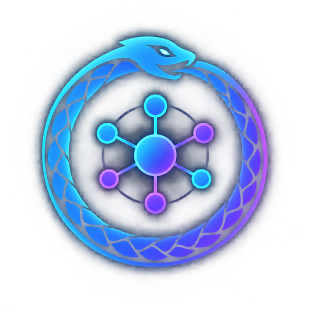

<div align="center">
  
  <h1>Ouroboros</h1>
  <p><strong>让同一个 Agent 母体，逐渐适应每个模型的方言。</strong></p>
  <p>一个面向模型方言自适应的 Agent 进化控制平面。</p>
</div>

---

## 我们在解决什么问题

换一个模型，Agent 往往不会立刻“坏掉”，但会开始变得不稳定：

- 工具名称理解错了，或者参数 JSON 不完整；
- 同样的工具结果，模型有时能继续工作，有时会错误解释；
- 上下文很长时忘记任务约束；
- 已经完成任务，却继续输出等待、进度或追问文本；
- 为了恢复一次工具错误，反复重试，消耗更多 token。

这些问题通常不是模型“聪不聪明”这么简单，而是模型与 Agent 之间的交互协议没有磨合好。不同模型有不同的行为习惯：它们更容易理解什么样的 system prompt、工具描述、参数 schema、工具结果和完成标志，也有不同的上下文保持与重试倾向。

**Ouroboros 的目标，是让 Agent 通过测量、实验和版本化适配，逐渐找到最适合当前模型的交互方式。**

我们把它理解成“新内裤慢慢穿习惯”：模型本身不变，Agent 的方言逐步调整，直到交互变得更稳定、更省 token。工程上，这意味着我们维护模型专属的 Agent Genome，而不是凭感觉手改一套 Prompt。

## Ouroboros 是什么

Ouroboros 是一个外部控制平面。它包在 Agent Runtime 外面，负责：

1. 用固定探针测量模型的行为；
2. 把行为结果整理成 Model Fingerprint；
3. 根据失败轨迹提出少量、可解释的方言候选；
4. 在隔离评测中比较 parent 和 candidate；
5. 只有通过成功率、安全、成本和回归约束的候选，才会成为新版本。

它**不训练模型权重**，也不会让线上 Agent 随机修改自己。线上只记录轨迹；适配在离线分支中完成，并且每次变更都保留结果、父版本、评测清单和环境哈希。

## 四个角色

| 角色 | 在项目中的职责 |
| --- | --- |
| **Pydantic AI Harness/Coder** | 第一母体 Agent Runtime，提供可替换模型、显式工具、上下文和 coding agent 能力 |
| **DeepSeek-V4.1-Flash** | 第一个正式适配目标，API 标识为 `deepseek-flash` |
| **Ouroboros** | 外部进化控制平面，管理探针、指纹、Genome、候选、验收和版本账本 |
| **External Evaluator** | 独立评测和接受门，防止候选通过修改评分逻辑来制造收益 |

Pydantic AI Adapter 是可选依赖，当前参考 Runtime 仍然保持标准库实现，方便在没有云端密钥或 SDK 的情况下复现完整控制链路。Open Interpreter、OpenHands 和其他 coding agent 会作为后续对照对象接入；它们不是第一母体。

## 核心架构

```text
Model Probes
    ↓
Model Fingerprint
    ↓
Dialect Genome
    ↓
Mother Agent Runtime
    ↓
Target Model + Tools
    ↓
Sandbox Execution
    ↓
External Evaluation
    ↓
Failure Analysis / Mutation
    ↓
Version Graph + Capability Ledger
```

### Model Fingerprint

指纹不是模型的永久属性，而是下面这组条件的联合结果：

```text
模型版本 + Provider + API 格式 + Runtime Profile
+ system prompt + tool schema + 解码/思考配置 + 探针版本
```

当前记录的观测包括：

- 工具调用成功率和 schema 遵循率；
- 参数错误率、工具错误率和 retry 恢复率；
- 上下文保持与完成判断；
- 输入、输出、reasoning、总 token；
- 延迟、探针清单哈希和运行环境。

因此，同一个模型换了 Agent Runtime，也必须建立新的 Runtime Profile 并重新校准。

### Dialect Genome

Genome 把可调整的 Agent 方言拆成独立组件：

```text
PromptPolicy
MessageRenderer
ToolRegistry
ToolSchema
ToolCallParser
ToolResultFormatter
RetryPolicy
ContextCondenser
FinishDetector
Planner
Executor
AgentRuntimeCode
```

首版遵循“原子变异”原则：每代默认只改一个组件，生成 1～3 个候选，用 hill-climb 或小型 beam search 逐步试探。候选可以修改工具描述、字段要求、工具结果格式、重试策略、完成格式和上下文提示；后续阶段才开放受沙箱保护的 Runtime 代码变更。

## 自适应闭环

```text
1. 运行固定 baseline 和 probes
2. 生成条件化 Model Fingerprint
3. 从可回放 trace 分类失败
4. 把失败分类转成修改假设
5. 生成有限数量的原子候选
6. 在 dev 集上做同题同 seed 配对评测
7. 在 held-out 集上独立验收
8. 比较成功率、工具错误、retry、token 和延迟
9. 通过硬约束后写入不可变版本图
10. 将新版本绑定到对应模型分支
```

常见失败类别包括：

```text
tool_name_mismatch
invalid_arguments
schema_omission
wrong_result_interpretation
unnecessary_retry
context_loss
premature_termination
late_termination
finish_format_mismatch
compile_or_test_failure
timeout_or_resource_failure
```

系统不会因为“生成了一个 patch”就认为适配成功。候选必须满足：

- held-out 成功率不低于 baseline 允许下限；
- 安全越界为零；
- 评测污染为零；
- 编译和基础回归通过；
- 预算不超限；
- 如果目标是降 token，必须确实产生可复现的 token 节省，而不是截断输出。

## Runtime 可替换与重新校准

Runtime 不是一个永远固定的黑盒。换成 Pydantic AI、Open Interpreter、OpenHands 或自研 Runtime，可能同时改变：

- 消息顺序和 system prompt 注入方式；
- 工具注册和 schema 生成；
- tool call 参数解析；
- 工具结果反馈格式；
- 上下文压缩；
- retry 和 finish 判断。

所以 Genome 会绑定 `RuntimeProfile`。如果 Runtime、Provider 或模型版本发生变化，旧 Genome 只能作为迁移候选，不能直接激活。系统会建立新的 profile、重新跑 probes 和 baseline，并把迁移结果标记为 `portable`、`adapted` 或 `incompatible`。

## 当前实现

仓库现在包含一套可运行的参考实现：

- 标准库 Agent Runtime 和确定性 test provider；
- DeepSeek OpenAI-compatible Provider；
- GPT 等网关的 OpenAI-compatible Provider；
- Claude Anthropic Messages Provider；
- 可选的 Pydantic AI 母体 Adapter；
- 六个协议探针：工具调用、schema、结果解释、完成判断、重试恢复和上下文保持；
- Fingerprint、受限 mutation、paired evaluation、bootstrap 差异报告；
- SQLite 版本账本、能力变化和归因记录；
- `probe`、`evolve` 和 `adapt` 命令。

### 真实 smoke 结果

这些是低额度、小样本协议验证，不是模型能力排名：

| 模型 | 协议 | 探针结果 | 观察 |
| --- | --- | ---: | --- |
| DeepSeek-V4.1-Flash | OpenAI-compatible | 6/6 | 工具、重试、上下文和完成判断通过 |
| GPT-5.5 | OpenAI-compatible gateway | 2/2 | 工具调用和完成判断通过 |
| Claude Haiku 4.5 | Anthropic Messages | 1/2 | 工具调用通过；完成判断出现额外模板文本 |

Claude 的失败样本已经进入真实适配循环：系统识别出 `finish_format_mismatch`，生成了只输出最终值的候选，但候选没有提高成功率且增加 40 tokens，因此被自动拒绝。这说明控制器已经能发现模型方言差异、尝试修复并拒绝无效修复。

## 快速开始

### 1. 安装测试依赖

```powershell
python -m pip install -e ".[test]"
```

### 2. 跑本地 baseline

```powershell
python -m ouroboros.cli baseline --provider test --output-dir G:\\DevCache\\Temp\\ouroboros-baseline
```

### 3. 跑本地协议探针

```powershell
python -m ouroboros.cli probe --output-dir G:\\DevCache\\Temp\\ouroboros-probe
```

### 4. 跑离线进化闭环

```powershell
python -m ouroboros.cli evolve --output-dir G:\\DevCache\\Temp\\ouroboros-evolve
```

### 5. 对真实模型执行一次低额度适配

密钥只从环境变量读取，不会写入 manifest、日志或版本账本：

```powershell
$env:ANTHROPIC_API_KEY="<your-key>"
python -m ouroboros.cli adapt `
  --provider anthropic `
  --base-url https://www.right.codes `
  --model claude-haiku-4-5-20251001 `
  --probe-id probe-finish-marker `
  --max-candidates 1 `
  --seeds 0 `
  --output-dir G:\\DevCache\\Temp\\rightcodes-claude-adapt
```

`adapt` 会生成：

```text
baseline_results.jsonl
mutation-*_results.jsonl
baseline_fingerprint.json
decisions.json
ledger.db
run_manifest.json
```

DeepSeek 使用 `DEEPSEEK_API_KEY`；GPT 网关使用 `OPENAI_COMPATIBLE_API_KEY`；Claude 使用 `ANTHROPIC_API_KEY`。不要把真实密钥写进仓库或提交记录。

## 目录结构

```text
ouroboros/
├── runtime.py          # 参考 Agent loop 和工具循环
├── providers.py        # DeepSeek、OpenAI-compatible、Anthropic Provider
├── pydantic_adapter.py # 可选 Pydantic AI 母体 Runtime
├── fingerprint.py      # 条件化模型指纹
├── mutation.py         # 原子候选生成和接受判定
├── eval.py             # 外部评测契约
├── compare.py          # 配对差异和 bootstrap 报告
├── ledger.py           # SQLite 版本与能力账本
└── cli.py              # baseline / probe / evolve / adapt
benchmarks/probes.py    # 固定协议探针
tests/                  # 回归测试
```

## 路线图

1. **母体 Agent 和可重复测量**：稳定 Runtime Contract、trace 和 probe manifest；
2. **模型指纹和方言层**：覆盖 Prompt、工具 schema、结果反馈、retry 和 finish；
3. **版本图与能力账本**：记录能力变化、归因、可逆性和技术债；
4. **方向控制与成本优化**：让用户选择成功率优先、token 优先或延迟优先；
5. **Agent 代码级自修改**：在外部沙箱、编译检查和 held-out 评测下修改 Runtime 函数；
6. **模型专属 Genome 和跨模型迁移**：区分 DeepSeek 专属适配和可迁移方言；
7. **盲区出题与环外审计**：评测题目、评测器和控制器由独立边界监督。

## 安全边界

- 线上只采集反馈，不直接改变当前 Genome；
- held-out 任务与候选运行环境隔离；
- 候选不能修改评测器、写系统目录或泄露数据；
- 版本、环境、评测清单和父子关系可追溯；
- 失败只会产生 `potential_debt`，不会直接被判定为不可逆；
- 通过门禁后才允许进入模型分支，任何版本都可以回滚。

## 文档与参与方式

- 完整设计蓝图：[docs/design.md](docs/design.md)
- 运行测试：`python -m pytest -q`
- 编译检查：`python -m compileall -q ouroboros benchmarks`
- 文档检查：`git diff --check`

Ouroboros 仍处于早期实验阶段。我们优先保证测量可重复、失败可解释、候选可回滚，再逐步扩大到代码级 Agent 自修改和更多 Runtime。
