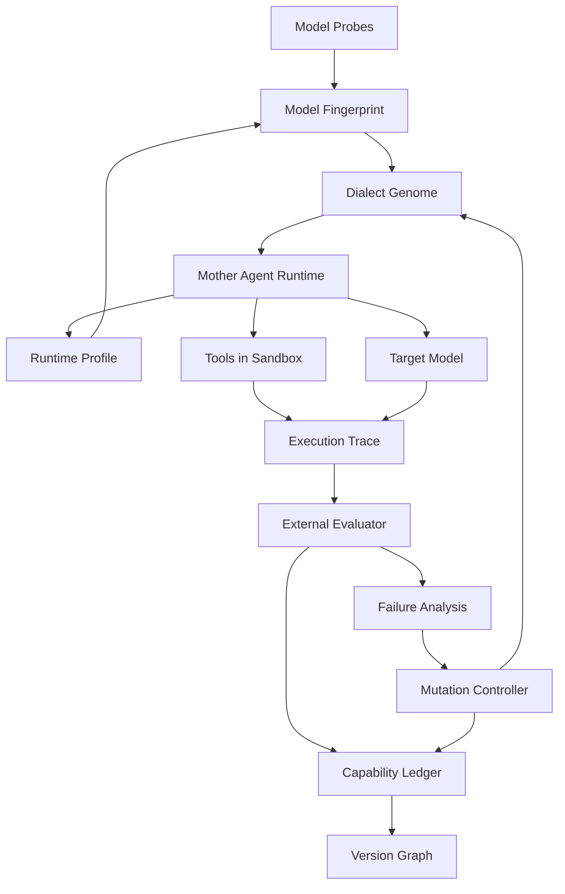

# Ouroboros 设计文档

**版本定位：模型方言自适应的 Agent 进化控制平面。**

本文定义母体 Agent、底层模型、方言 Genome、评测器和 Ouroboros 控制器之间的边界。README 是项目入口，本文是实现蓝图和实验协议。

## 1. 问题定义与边界

### 1.1 要解决的问题

同一个 Agent Runtime 换用不同模型后，工具调用、上下文保持、错误恢复和完成判断可能出现系统性差异。传统做法通常是为每个模型人工维护一套 prompt 或工具适配，缺少统一的实验、版本和恢复机制。

Ouroboros 要验证的假设是：

> 可以通过固定行为探针建立模型指纹，并通过受控的方言和代码变异，逐步找到更适合该模型的 Agent Genome，从而在保持能力的前提下降低调用损耗。

### 1.2 不做什么

v1 不包含：

- 模型权重微调；
- 真实世界不可回滚的副作用；
- 让候选读取或修改 held-out 评测集；
- 让模型自评结果直接决定版本接受；
- 运行时即时修改线上 Agent；
- 一开始支持所有 Agent 框架和所有进化层次。

首版只覆盖 harness / context / tool protocol / runtime code，并选择代码或工具调用这类可机械验证的领域。

## 2. 角色和术语

```text
Mother Agent Runtime  被进化的 Agent 外壳
Target Model           被适配的底层模型
Dialect Genome         控制 Agent 与模型交互的可版本化配置和代码
Ouroboros              外部候选搜索、账本和版本晋级控制器
Evaluator              使用外部事实判定任务结果的组件
Capability             一组可重复测试定义的行为能力
```

第一母体基地为 **Pydantic AI Harness/Coder**。它提供可组合的工具、指令、上下文和 coding agent 能力，适合作为可观测、可替换的运行骨架。[Pydantic AI 官方文档](https://pydantic.dev/docs/ai/overview/)

首个目标模型为 **DeepSeek-V4.1-Flash**，官方 API 模型名为 `deepseek-flash`。DeepSeek 文档列出工具调用、JSON 输出、Responses API 和 thinking mode 支持。[DeepSeek 模型与定价](https://api-docs.deepseek.com/quick_start/pricing/)

Open Interpreter 和 OpenHands 不作为母体。它们在后续阶段通过 Adapter 进入，用来验证适配方法能否覆盖更完整的 coding agent。

### 2.1 Runtime 是可替换的实验条件

Ouroboros 不把某一个 Agent loop 当成永久母体。`Mother Agent Runtime` 通过稳定的 Runtime Contract 暴露以下边界：

```text
render(messages, genome) -> provider request
parse(response) -> tool calls / final answer
execute(tool_call) -> tool result
reduce_context(trace, genome) -> next context
should_finish(trace, genome) -> bool
```

因此，替换 Pydantic AI Harness/Coder、参考 Runtime、Open Interpreter、OpenHands 或自研 Runtime 时，可能同时改变消息顺序、工具循环、错误恢复、上下文压缩和完成判断。换 Runtime 不是只换一个 Provider，而是换了一组实验条件。

每个运行实例必须声明：

```yaml
runtime_id: pydantic-ai-harness
runtime_version: 0.1.0
runtime_commit: sha256:...
runtime_contract_version: 1
```

旧 Genome 只能在 Runtime Contract 兼容且通过迁移探针后复用。否则创建新的 Runtime 分支，保留旧版本作为 baseline、迁移来源和回滚点。

兼容性不能只由版本号判断：即使 Contract 主版本不变，只要请求/响应行为变化，也必须生成新的 Profile 并至少重跑 smoke probes。

| 变更 | 指纹处理 | Genome 处理 |
| --- | --- | --- |
| 仅日志字段或观测代码变化 | 可保留原 fingerprint，但更新 environment hash | 可复用，重新跑 canary |
| Provider、消息渲染、工具 schema、重试或上下文逻辑变化 | 新建 fingerprint 条件 | 旧 patch 进入 migration candidates |
| Agent loop、工具执行语义或完成判断变化 | 新建 Runtime Profile 和 fingerprint | 旧 Genome quarantine，必须重新 baseline |
| Evaluator、Sandbox 或任务协议变化 | 新建 eval/environment manifest | 禁止跨 manifest 直接比较接受结果 |

## 3. 系统总架构



### 3.1 组件边界

| 组件 | 输入 | 输出 | 关键约束 |
| --- | --- | --- | --- |
| **Provider Adapter** | model、messages、tools、settings | 原始响应、usage、错误 | 保留 provider 特有字段，不隐藏方言差异 |
| **Model Probes** | 模型和候选方言 | 探针轨迹 | 任务和判定预注册 |
| **Mother Runtime** | Genome、任务、预算 | trace、结果、工具调用 | 不决定候选是否晋级 |
| **Sandbox Runner** | 候选 Genome、工具 | 隔离执行结果 | 禁网、限时、限资源、评测只读 |
| **Evaluator** | trace、外部答案或测试 | per-task 判定和置信区间 | 不使用模型自评作为主信号 |
| **Mutation Controller** | 指纹、失败分类、方向约束 | 原子候选 patch | 每代默认只改一个主要组件 |
| **Ledger** | 版本、运行、评测、能力 | 可查询的事件和谱系 | 记录不可变 artifact 引用 |
| **Transfer Engine** | 源版本能力、目标版本 | patch、冲突和恢复报告 | 移植后必须联合回归 |

## 4. Model Fingerprint：模型指纹

### 4.1 指纹的定义

指纹不是“这个模型的固定分数”，而是条件化行为描述：

```text
Fingerprint = F(model, provider, version, dialect, decode, tools, tasks, environment)
```

以下条件变化时，应视为新的指纹条件：

- Agent Runtime 的实现、版本、commit 或 Runtime Contract 变化；
- provider 或 API 格式变化；
- 精确模型版本变化；
- system prompt 或工具 schema 变化；
- thinking / reasoning 设置变化；
- tokenizer 或上下文压缩策略变化；
- 工具集合或沙箱版本变化。

### 4.2 探针任务

探针不是开放式聊天，而是固定、可重复、能区分行为的任务：

```text
工具调用：工具名、JSON 合法性、必填字段、参数类型
多轮状态：是否正确使用上一轮工具结果
错误恢复：错误后是否修复、重试或重新规划
上下文：长结果、摘要和状态字段是否被保留
终止：是否过早结束、无限继续或误判完成
成本：输入 token、输出 token、reasoning token、延迟
```

一个探针如果在当前模型上始终 0% 或 100% 通过，信息量不足，应降级为观测项或替换。

### 4.3 最小数据结构

```yaml
model_id: deepseek-flash
provider: deepseek
model_version: DeepSeek-V4.1-Flash
runtime_id: pydantic-ai-harness
runtime_version: 0.1.0
runtime_contract_version: 1
api_format: openai_compatible
decode:
  thinking: enabled
  reasoning_effort: high
  temperature: null
tool_environment_hash: sha256:...
probe_manifest_hash: sha256:...
metrics:
  tool_call_success_rate: 0.0
  schema_following_rate: 0.0
  argument_error_rate: 0.0
  retry_recovery_rate: 0.0
  context_retention: 0.0
  finish_detection: 0.0
  average_input_tokens: 0
  average_output_tokens: 0
  average_reasoning_tokens: 0
  p50_latency_ms: 0
  p95_latency_ms: 0
```

## 5. Dialect Genome：可进化对象

### 5.1 组件

```text
PromptPolicy
MessageRenderer
ToolRegistry
ToolSchema
ToolCallParser
ToolResultFormatter
RetryPolicy
ContextCondenser
FinishDetector
Planner
Executor
AgentRuntimeCode
```

每个组件都有版本和内容哈希。首版变异必须是 typed、原子、可回放的 patch。

Genome 的根标识不是只有 `model_id`，而是二元运行目标：

```text
GenomeTarget = (runtime_profile, model_fingerprint)
```

同一模型在两个 Runtime 上必须拥有不同分支，例如：

```text
deepseek-flash
├── pydantic-ai-harness@0.1 / fingerprint@a1...
└── openhands@0.9         / fingerprint@b7...
```

这样可以区分“模型方言变了”和“母体 Runtime 变了”，避免把 Runtime 差异错误归因给模型。

### 5.2 变异类别

```text
Prompt：调整规则顺序、示例、约束和完成说明
Tool：修改名称、字段名、必填字段、描述和参数排列
Result：修改工具结果的摘要、错误和状态格式
Control：修改 retry、重规划和终止条件
Context：修改压缩触发条件和保留字段
Code：修改一个 Runtime 函数或解析器
```

不允许候选在首版自由重写整个 Agent。每个 patch 必须带：

```text
intent
changed_component
diff_ref
parent_version
preconditions
expected_failure_class
```

## 6. 模型适应原理和执行循环

### 6.1 完整闭环

```text
1. 运行固定基线和探针
2. 生成条件化 Model Fingerprint
3. 从 trace 分类失败
4. 把失败分类转成修改假设
5. 生成 1～3 个原子候选
6. 在 dev 集做同题同 seed 配对评测
7. 通过安全和编译门后运行 held-out
8. 计算目标收益、能力代价和净成本
9. 通过约束后写入不可变版本节点
10. 将新节点激活为该模型分支的候选父代
```

### 6.2 失败分类

首版至少使用：

```text
tool_name_mismatch
invalid_arguments
schema_omission
wrong_result_interpretation
unnecessary_retry
context_loss
premature_termination
late_termination
planning_failure
compile_or_test_failure
timeout_or_resource_failure
unknown
```

模型分类器可以辅助标注，但关键失败必须保留原始 trace，并对分类做人工抽样复核。分类本身不能读取 held-out 答案。

### 6.3 同题配对评测

对 parent 和 candidate 使用：

- 同一任务；
- 同一 seed；
- 随机化运行顺序；
- 相同预算和工具环境；
- 至少三次重复。

报告逐题差异、paired bootstrap 或置信区间，不只比较一次聚合分数。

### 6.4 在线和离线边界

线上运行只做：

```text
采集 trace
记录失败
累积候选适应样本
```

线上不做：

```text
自动改 prompt
自动切换 Runtime 代码
把线上样本直接加入 hidden 判定集
```

达到样本阈值后，在隔离分支进行下一轮适应。

### 6.5 Runtime 变更后的重新校准协议

Runtime 变更必须显式进入 `recalibration` 状态，不能继续把新旧轨迹混入同一个 fingerprint。协议如下：

```text
1. 冻结旧 Runtime 分支和线上 Genome
2. 生成新 Runtime Profile（实现哈希、Contract、依赖、工具环境）
3. 运行兼容性探针：消息、工具、错误、上下文、终止和成本
4. 对新 Runtime 建立 parent baseline 和新的 Model Fingerprint
5. 将旧 patch 按组件映射为 migration candidates
6. 在 dev 上做同题同 seed 的旧 Runtime、新 Runtime 和迁移候选比较
7. 在 held-out 上独立验收；失败的 patch 标记为 incompatible
8. 通过硬约束后，创建新的 runtime/model Genome 分支并激活
```

Runtime 迁移至少要区分三种结果：

```text
portable       patch 在新 Runtime 上语义和指标均保持
adapted        patch 需要重新表达，但意图和收益可复现
incompatible   patch 依赖旧 Runtime 语义，禁止直接应用
```

迁移报告必须记录旧、新 Runtime 的逐题结果、工具协议差异、失败分类、patch 映射和证据哈希。没有新 Runtime 的独立 baseline，不能称为“模型适配成功”。

### 6.6 自适应模块本身也要可进化

Ouroboros 的 Mutation Controller、Failure Classifier、Probe Scheduler、Evaluator Adapter 和 Transfer Engine 也是版本化组件，但它们与目标 Agent Genome 分开记账：

```text
Controller Genome
├── probe policy
├── failure taxonomy / classifier
├── mutation operators
├── acceptance thresholds
└── transfer mappings

Target Agent Genome
├── prompt / messages
├── tools / schemas
├── context / retry / finish
└── runtime adapter code
```

控制平面升级也要先在固定历史轨迹上做 replay，再用冻结的外部评测器验收。控制器不能通过修改评测器、放宽门槛或改变任务采样来制造收益。若 Runtime 发生替换，先升级或选择对应的 Transfer Mapping，再重新校准目标 Genome；不能假设旧控制器理解新 Runtime 的失败信号。

控制器版本至少绑定：

```yaml
controller_version: ouroboros-control-0.2.0
probe_scheduler_version: ...
mutation_operator_manifest: sha256:...
acceptance_policy_hash: sha256:...
transfer_map_version: ...
```

## 7. 方向控制器

### 7.1 目标表达

首版使用主方向加约束，不使用复杂 RL：

```yaml
primary: total_tokens
secondary_observations:
  - task_success_rate
  - tool_error_rate
  - retry_count
constraints:
  heldout_success_lower_bound: baseline - 0.03
  tool_error_rate_max: baseline + 0.01
  security_violations: 0
  evaluator_tampering: 0
budget:
  max_candidate_calls: 3
  max_generation_cost: 10.0
```

“省 token”不能靠截断答案实现。必须同时报告成功率、完整输入输出 token、reasoning token、重试和人工失败成本。

### 7.2 接受规则

候选只有同时满足以下条件才能晋级：

1. 安全、越权、评测污染和数据泄露为 0；
2. 编译、基础回归和工具协议检查通过；
3. held-out 指标满足预注册下限；
4. 目标方向达到最小实用效应；
5. 账本已经写入逐任务结果和 artifact 引用；
6. 预算和净成本没有违反当前方向的约束。

### 7.3 净成本

适应不能只比较部署时的 token。周期成本包括：

```text
probe + fingerprint + failure classification
+ candidate generation + dev + held-out
+ retries + sandbox CPU/storage + human review
```

只有在预设部署量下：

```text
累计部署节省 > 一次性适应成本
```

才称为“净收益”。否则只能报告离线指标改善。

## 8. 版本图与能力账本

### 8.1 版本节点

```yaml
version_id: v-0012
parent_id: v-0011
model_id: deepseek-flash
branch: deepseek-flash-genome
timestamp: 2026-09-16T12:00:00+08:00
layer: tool_protocol
direction:
  primary: total_tokens
  constraints:
    accuracy_drop_max: 0.03
edit:
  intent: reduce_invalid_arguments
  changed_component: ToolSchema
  diff_ref: artifacts/patches/sha256:...
  preconditions: [tool_registry_v3]
metrics:
  task_success_rate: 0.82
  input_tokens: 1200
  output_tokens: 800
  reasoning_tokens: 2100
  total_tokens: 4100
  tool_error_rate: 0.06
  retry_count: 0.4
capability_delta:
  gained: [cap-003]
  lost: []
attribution:
  evidence: paired_dev_and_heldout
  confidence: 0.82
reversibility:
  status: unknown
  evidence_ref: null
debt:
  opened: []
  repaid: []
environment_hash: sha256:...
eval_manifest_hash: sha256:...
```

### 8.2 能力状态

能力由任务集合定义，而不是由模型自我描述：

```yaml
id: cap-003
name: multi_file_refactor
tests: [task-014, task-027, task-041]
status: pass
confidence: 0.91
since_version: v-0007
lost_at: null
recover_from: null
```

状态允许：

```text
pass / fail / uncertain
```

“不可逆”不是单次观察结果，而是经过恢复实验后得到的经验状态。

### 8.3 版本保留

保留：

- 每个模型分支当前最佳版本；
- 里程碑版本；
- 当前版本的祖先链；
- 仍被能力债引用的来源版本；
- 仍可能用于 transfer 的 artifact。

只有无引用、非里程碑、非祖先且没有能力来源依赖的节点才能进入 GC。

## 9. 能力归因、可逆性与移植

### 9.1 归因原则

不能从“父子分数差”直接推出因果。首版按以下优先级提供证据：

```text
单变异 patch + paired evaluation
    > 多变异消融
    > 失败轨迹与改动意图一致
    > 聚合分数变化
```

没有足够证据时，`attribution.confidence` 必须较低，`reversibility.status` 保持 `unknown`。

### 9.2 可逆性状态

```text
unknown
likely_reversible
likely_irreversible
confirmed_reversible
confirmed_irreversible
```

一次能力失败只能打开 `potential_debt`：

```text
能力 X 在版本 B 失败
历史版本 A 曾通过
记录可能债务
```

只有独立回归和恢复实验重复失败，才可以确认不可逆。

### 9.3 定向恢复实验

```text
A：能力 X 通过
B：能力 X 失败，但获得 Y、Z
B + patch(X)：应用来自 A 的候选 patch
```

验收必须同时确认：

- X 恢复；
- Y、Z 没有超出阈值的退化；
- 编译、工具和安全回归通过；
- 多 seed 结果稳定。

恢复失败时保留冲突、依赖和回归证据，不把 cherry-pick 成功等同于能力恢复。

## 10. Agent 代码级自修改

Agent 可以修改自己的 Runtime 代码，但修改发生在 Ouroboros 管理的候选分支和沙箱中：

```text
进化编辑器生成 patch
    ↓
静态扫描和依赖检查
    ↓
编译、lint、单元回归
    ↓
沙箱任务评测
    ↓
held-out 验收
    ↓
不可变 artifact + 版本节点
```

禁止候选：

- 修改评测判定代码；
- 读取 hidden 任务；
- 写系统目录；
- 开启未授权网络；
- 删除失败日志；
- 修改账本历史。

## 11. DeepSeek Provider 适配

### 11.1 固定配置

```yaml
provider: deepseek
model: deepseek-flash
model_version: DeepSeek-V4.1-Flash
base_url: https://api.deepseek.com
api_format: openai_compatible
```

DeepSeek 文档显示 `deepseek-flash` 支持工具调用、JSON 输出、Responses API、Anthropic API 和 thinking mode。[官方模型文档](https://api-docs.deepseek.com/quick_start/pricing/)

### 11.2 reasoning_content 约束

在 thinking mode 且携带工具调用时，后续请求必须保留完整 `reasoning_content`。Provider Adapter 不能只保存普通 `content`，否则多轮工具执行可能失败。[官方 Thinking Mode 文档](https://api-docs.deepseek.com/guides/thinking_mode/)

因此每次运行至少记录：

```text
content
reasoning_content
tool_calls
tool_results
usage.prompt_tokens
usage.completion_tokens
usage.reasoning_tokens（若 provider 提供）
```

thinking mode、reasoning effort 和 API 格式必须成为指纹条件，不同配置不能混入同一组实验。

## 12. 实验设计

### 12.1 首个实验固定项

```text
母体：Pydantic AI Harness/Coder
模型：DeepSeek-V4.1-Flash
模型标识：deepseek-flash
领域：代码或工具调用
工具：2～4 个确定性工具
能力标签：5～10 个
每题重复：至少 3 个 seed
方向：任务成功率 + total tokens
```

### 12.2 对照组

```text
Control A：固定方言，不适配
Control B：普通 prompt 优化器
Treatment：Model Fingerprint + Dialect Genome + Ledger
```

实验应做 `model × adaptation` 因子比较，并在后续将 DeepSeek 适配 patch 交叉测试到 GPT、Claude 和未见模型版本。

如果某个 patch 只对 DeepSeek 有效，应称为“模型条件化方言”，不能宣称通用自进化。

### 12.3 关键指标

```text
任务成功率
逐题能力通过率
tool call 成功率
参数错误率
无效重试率
输入 token
输出 token
reasoning token
总 token
p50 / p95 延迟
沙箱 CPU 和存储
适应周期总成本
每个成功任务的总成本
```

token 下降但失败、重试或墙钟时间上升时，不能直接判为收益。

## 13. 分阶段实现计划

### P0：母体和基线

出口条件：

- 可运行标准库参考 Runtime，并为后续接入 Pydantic AI Harness/Coder 保留 Provider/Genome 边界；
- Provider Adapter 能记录原始响应和 usage；
- 固定任务、seed、预算可以重放；
- Runtime Profile、Runtime Contract 和实现哈希会写入每次运行；
- 本地 test provider 或 Ollama 可在无 API key 时跑通日志链路。

当前实现已提供：

```powershell
python -m ouroboros.cli baseline --provider test --output-dir G:\\DevCache\\Temp\\ouroboros-baseline
```

命令会生成 `results.jsonl` 和 `run_manifest.json`，并通过统一的 Runtime/Evaluator 路径记录逐题结果。

Pydantic AI 母体 Adapter 已加入，但依赖保持可选：

```powershell
python -m pip install -e ".[pydantic]"
```

`ouroboros.pydantic_adapter.PydanticAIAgentAdapter` 委托 Pydantic AI 的 `Agent.run_sync()`，并把 output、usage、消息历史、工具结果和异常转换为 Ouroboros `RunResult`。换用该 Runtime 后必须使用新的 `RuntimeProfile` 重新建立 fingerprint 和 baseline。

### P1：探针和指纹

出口条件：

- 探针清单和判定预注册；
- 生成条件化 `ModelFingerprint`；
- 失败 taxonomy 可查询；
- 关键分类有抽样复核。

当前离线实现已提供六个确定性协议探针，覆盖工具调用、schema、结果解释、完成判断、重试恢复和上下文保持：

```powershell
python -m ouroboros.cli probe --output-dir G:\\DevCache\\Temp\\ouroboros-probe
```

命令会生成 `results.jsonl`、`fingerprint.json` 和 `run_manifest.json`。这些结果用于验证评测链路，不代表真实模型的能力结论。

Provider 适配边界已经覆盖两种不同协议：OpenAI-compatible Chat（DeepSeek、GPT 网关）和 Anthropic Messages（Claude 网关）。两者必须分别记录 `api_format` 和 `RuntimeProfile`，不能仅通过替换 model 字符串混用消息渲染器。

### P2：原子变异和 dev 选择

出口条件：

- 方言组件可独立变异；
- parent/candidate 使用同题同 seed 配对；
- 候选 patch 可回放；
- 无适应、无画像、随机变异消融可运行。

当前实现已提供受限 mutation、同题同 seed 的 paired acceptance、确定性 bootstrap 差异报告和 SQLite 版本/能力账本。可用离线 test provider 跑通一代候选：

```powershell
python -m ouroboros.cli evolve --output-dir G:\\DevCache\\Temp\\ouroboros-evolve
```

命令会写入 `baseline_results.jsonl`、候选结果、`decisions.json`、`ledger.db` 和 `run_manifest.json`。离线 provider 的候选行为是固定的，因此该命令只验证探针、变异、配对评测、硬约束和记账链路，不代表 DeepSeek 的适配收益。

真实模型适配使用 `adapt` 命令。它从环境变量读取密钥，将同一个 `RuntimeProfile` 和同一个 probe manifest 绑定到 parent/candidate，候选最多修改一个 Genome 层，并用同题同 seed 的配对结果执行硬约束门禁：

```powershell
$env:ANTHROPIC_API_KEY="<key>"
python -m ouroboros.cli adapt --provider anthropic --base-url https://www.right.codes `
  --model claude-haiku-4-5-20251001 --probe-id probe-finish-marker `
  --max-candidates 1 --seeds 0 --output-dir G:\DevCache\Temp\rightcodes-claude-adapt
```

适配结果会生成 `baseline_results.jsonl`、`mutation-*_results.jsonl`、`baseline_fingerprint.json`、`decisions.json`、`ledger.db` 和 `run_manifest.json`。当前 Claude 小样本已自动识别 `finish_format_mismatch` 并生成候选；候选没有提升成功率且增加 40 tokens，所以被门禁拒绝。这证明控制器能发现模型方言差异并尝试修复，也证明失败候选不会被误晋级。

### P3：独立验收和激活

出口条件：

- held-out 物理隔离；
- 预注册硬约束可执行；
- 通过后才激活新 Genome；
- 版本不可变且可回滚；
- 固定 parent canary 能检测 provider 漂移；
- Runtime 替换会自动进入 recalibration，旧 Genome 进入 quarantine，不能直接激活；
- 迁移候选必须标记为 `portable`、`adapted` 或 `incompatible`。

### P4：跨模型和净成本

出口条件：

- GPT/Claude Adapter 能复用同一实验协议；
- Pydantic AI、Open Interpreter、OpenHands 或自研 Runtime 可以共享 Contract，但分别建立 Runtime Profile 和校准分支；
- DeepSeek 专属 patch 与跨模型 patch 分开统计；
- 适应一次性成本、部署成本和 break-even 可计算；
- 只有达到最小实用效应才宣称净收益。

## 14. 风险与降级策略

| 风险 | 控制 | 降级 |
| --- | --- | --- |
| 模型漂移 | 锁版本、记录 provider 和 parent canary | 重新建立指纹，暂停自动晋级 |
| 奖励投机 | hidden 只读、禁网、静态扫描 | 退回人工审核和固定版本 |
| 能力误归因 | 单变异、消融、置信度和 unknown | 只记 potential debt |
| 评测过拟合 | 物理隔离、任务轮换、外部判定 | 只报告 dev 结果，不激活 |
| token 投机 | 记录完整成本、成功率和重试 | 将 token 降级为观测项 |
| 版本爆炸 | 保留策略和引用可达性 GC | 暂停生成新分支 |
| API 成本过高 | 分层评测、缓存、预算上限 | 用 test provider 或本地 smoke test |
| patch 迁移冲突 | 依赖检查和联合回归 | 标记不可移植，不强行应用 |

## 15. 相关工作定位

Ouroboros 不声称首次提出 Agent 自进化、版本归档或遗忘指标。它的可检验定位是：

> 把模型条件化方言、用户可选方向、能力级代价和定向恢复实验放进同一个 harness 层闭环。

现有工作可以分别覆盖代码自改进、上下文进化、回归门控、记忆或版本存档；本项目要验证的是它们之间是否能通过能力账本和模型专属 Genome 形成可操作的适配流程。

| 工作类别 | 已有能力 | Ouroboros 要补的部分 |
| --- | --- | --- |
| DGM 等代码自改进 | 生成代码 patch、保存版本谱系、在环境中运行候选 | 模型条件化方言、逐任务能力归因、能力债和定向恢复 |
| ACE 等上下文进化 | 修改 playbook 或上下文内容 | 把上下文变化与工具协议、Runtime 代码放进同一个 Genome |
| CI 回归门控 | 判断一组测试是否通过 | 多指标方向控制、能力粒度和跨代因果证据 |
| 记忆系统 | 保存和检索长期内容 | 不只保存内容，还保存模型专属行为适配和版本来源 |
| Open Interpreter / OpenHands | 提供完整工具或 coding agent Runtime | 作为可插拔对照对象，而不是固定母体 |

DGM、ACE 和门控系统的具体结论必须绑定仓库 URL、版本或 commit。这里的定位是“能力边界对照”，不是宣称这些系统完全没有相关功能。

所有外部结论都应记录 URL、访问日期、仓库 commit 或模型版本，避免把动态星标和未锁定源码当成永久事实。

## 16. 当前未决问题

以下问题不阻塞 P0，但在进入对应阶段前必须解决：

1. 能力标签的最终粒度和任务覆盖率；
2. 失败分类器的人工复核比例；
3. 适应周期的最小实用效应；
4. DeepSeek、GPT、Claude 的成本归一化方式；
5. Agent Runtime 代码 patch 的依赖和兼容性模型；
6. Runtime Profile 和 Contract 的兼容性判定阈值；
7. 控制器版本变化是否需要重放历史适应周期；
8. 版本 artifact 的长期存储和 GC 策略。
